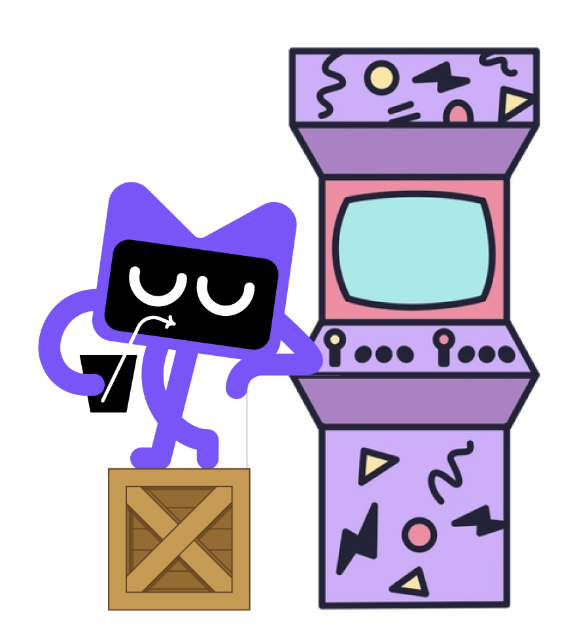

# Kodee's Arcade

## What is Kodee's Arcade?

Kodee's Arcade is a gaming platform, written in Kotlin,
built exclusively for Kotlin programming games.

### Status

Very much a work-in-progress.

The platform is being built with only a single game at the moment, a racing game.
We'll validate the concept works, expand the arcade with more games,
and then design an API for third-party games.

## Getting Started

Want to try out what we have? Check out our [getting started](/GETTING_STARTED.md) guide!

## Architecture

### Machine

The main application for Kodee's Arcade, called [the machine](/arcade-machine), is split into 4 parts:
1. [Application](/arcade-machine/arcade-app): The execution entrypoint for Kodee's Arcade. Available as both a desktop and web application.
2. [Display](/arcade-machine/arcade-display): Used to render the display for the application and games.
3. [Engine](/arcade-machine/arcade-engine): Used to execute games via an available Wasm runtime.
4. [Multicade](/arcade-machine/arcade-multicade): Core components needed by all parts of the machine.

### Service

Kodee's Arcade can also be run as [a service](/arcade-service), which is split into 5 parts:
1. [Server](/arcade-service/arcade-server): Stores persistent game resources (drivers, tracks, seasons, etc.) and game recordings.
2. [Client](/arcade-service/arcade-client): HTTP client used to communicate with the server.
3. [API](/arcade-service/arcade-api): API request and response models shared between server and client.
4. [WebApp](/arcade-service/arcade-webapp): Used to interact with the server to manage game resources and request game execution.
5. [Worker](/arcade-service/arcade-worker): Connects to a server and runs games. Allows off-loading game execution to more powerful servers and scaling as needed.

### Player

Kodee's Arcade is played by creating a "Player",
a Wasm program which controls the behavior of a player in a simulated game.
The [API of the player](/arcade-player) can be used to create a Wasm program
which is able to interact with the arcade.

### Intersections

The Machine uses some Service parts and the Service uses some Machine parts.

* The engine uses the player API to communicate with each Wasm program.
* The worker uses the engine to execute games.
* The display uses the client to talk with an available server and download resources for local use.
* The webapp uses the display to watch recorded games.
